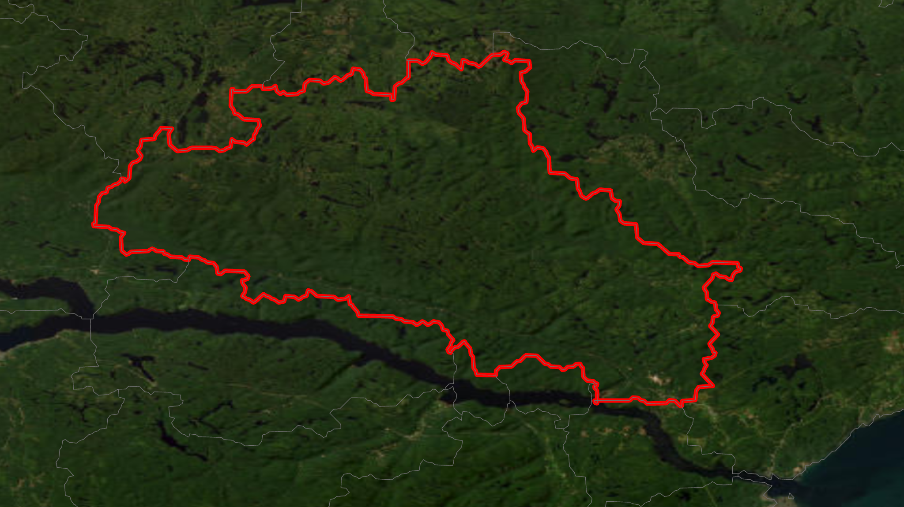

Downloading and Using the Copernicus DEM
========================================

Pycequeau provides native support for the **Copernicus Digital Elevation Model (COP-DEM)**  as a built-in global elevation source.

The Copernicus DEM GLO-30 product provides:

- Global coverage
- Approximately 1 arc-second spatial resolution (~30 m)
- Full high-latitude coverage (including regions above 60°)

Unlike SRTM, which has limited coverage at high latitudes, the Copernicus DEM  is suitable for northern, making it particularly useful
for Arctic and sub-Arctic hydrological applications. The dataset is distributed under an open licence through the Copernicus Data Space Ecosystem.

For detailed information about production methods, accuracy, and licensing, see the official product description:

https://dataspace.copernicus.eu/explore-data/data-collections/copernicus-contributing-missions/collections-description/COP-DEM

How Pycequeau Uses the Copernicus DEM
-------------------------------------

This section demonstrates how to use the Pycequeau API to download and prepare
the Copernicus DEM for a given study area.

The spatial extent of a basin can be determined using reference datasets such as HydroSHEDS or other
authoritative hydrographic products. In this example, the Sainte-Marguerite River basin (shown below) is used as a case study.

   

Defining the Study Extent
~~~~~~~~~~~~~~~~~~~~~~~~~

After identifying the basin, the user must define a bounding box that fully
encloses the watershed. The extent should be expressed as:

::

    [xmin, xmax, ymin, ymax]

in geographic coordinates (longitude, latitude).

For this example, the extent is defined as:

::

    extent = [-71.0, -69.5, 48.0, 48.8]

This bounding box was extracted using GIS software. It is recommended to
define an extent slightly larger than the exact basin boundary to prevent
edge clipping and ensure complete DEM coverage.

Downloading and Merging the DEM
~~~~~~~~~~~~~~~~~~~~~~~~~~~~~~~

Once the extent is defined, the following code downloads the required
Copernicus GLO-30 tiles, merges them, and clips the result to the specified
extent.

.. code-block:: python

    from pycequeau.core import CopernicusDEMProcessor

    project_path = "path/to/your/project/geographic"
    extent = [-71.0, -69.5, 48.0, 48.8]

    cop_dem = CopernicusDEMProcessor(project_path, extent)
    cop_dem.download_and_merge()

Output Files
~~~~~~~~~~~~

After execution, two raster files are generated in the project directory:

- ``DEM.tif`` — Merged and clipped Copernicus DEM.
- ``WBM.tif`` — Water Body Mask associated with the DEM tiles.

The water body mask is used in subsequent Pycequeau workflows to:

- Compute the percentage of water within each CP and CE unit.
- Perform basin DEM conditioning.
- Improve flow direction accuracy.
- Reduce uncertainties caused by elevation artefacts over water surfaces.

