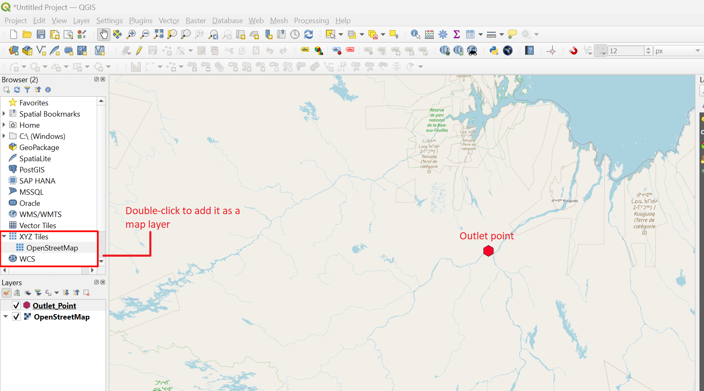
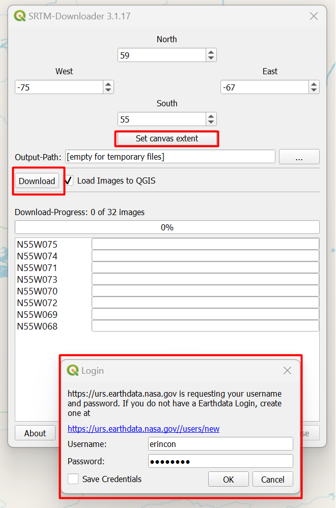
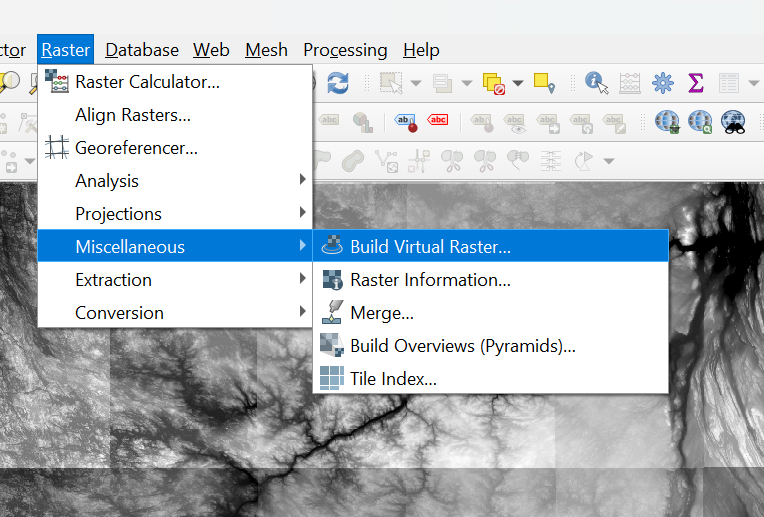
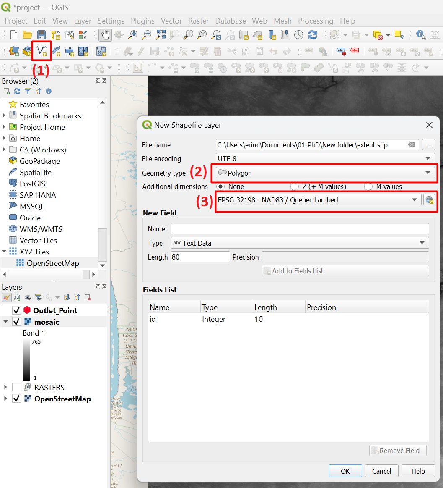
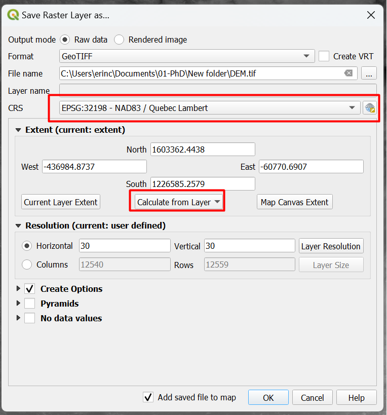
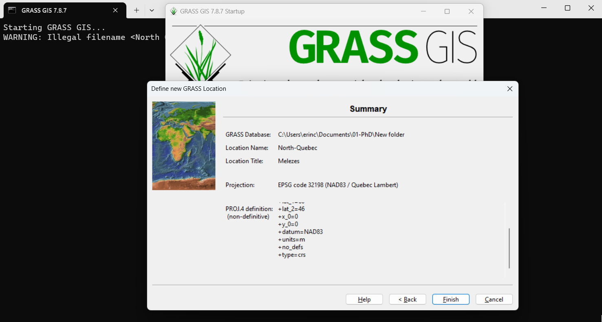
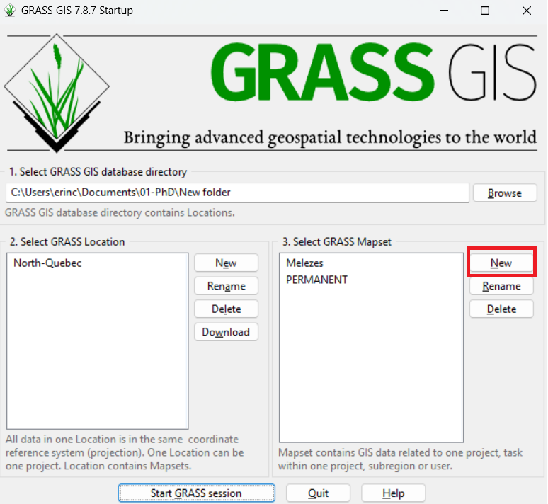
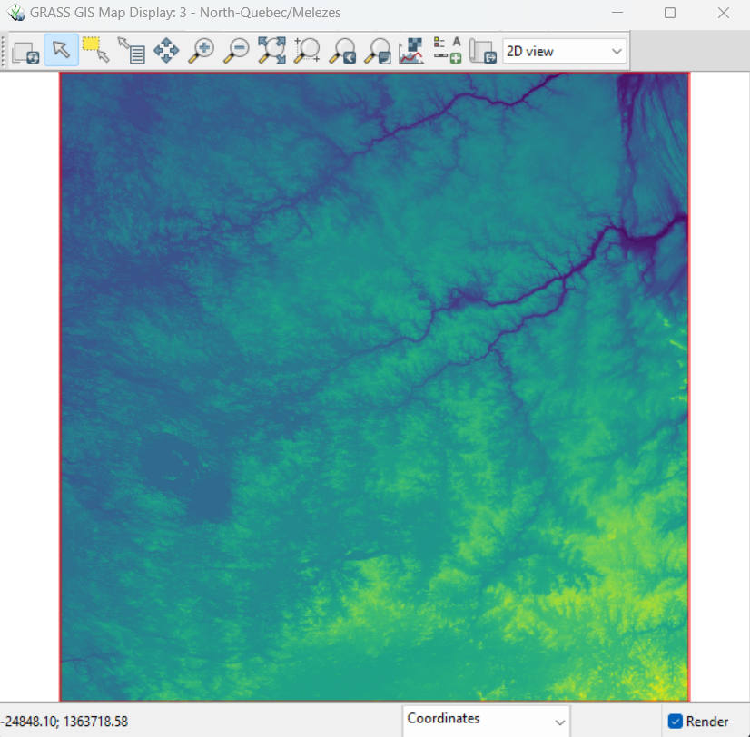
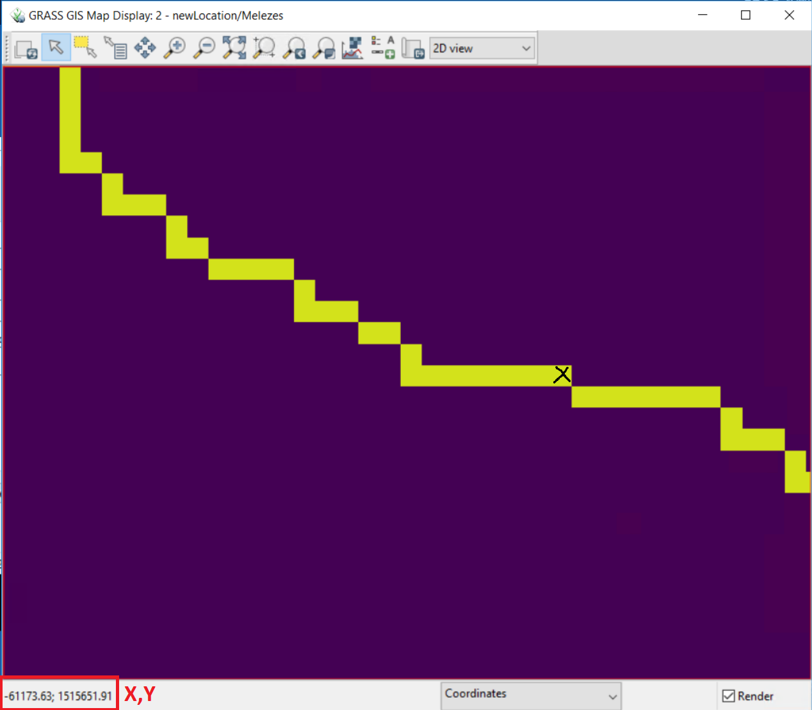
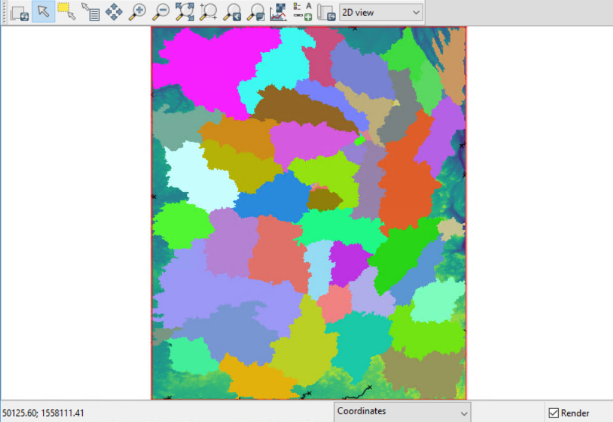

Getting the geographical data with grass
========================================

The pycequeau library requires several ``.shp`` and ``.tif`` files to extract the physiographical. The toolbox is designed to accept data formats from GIS-based software such as `QGIS`_, `ArcGIS`_, `SAGA-GIS`_, or `GRASS-GIS`_.

.. _QGIS: https://www.qgis.org/en/site/forusers/download.html
.. _ArcGIS: https://pro.arcgis.com/en/pro-app/latest/get-started/download-arcgis-pro.htm
.. _GRASS-GIS: https://grass.osgeo.org/download/
.. _SAGA-GIS: https://sourceforge.net/projects/saga-gis/files/

Download the DEM
----------------

We will use QGIS and GRASS-GIS as the base software to obtain all the files in this case. We will start by downloading the DEM using the SRTM-downloader plugin available through QGIS. Then, in the plugins manager placed in, click on ``Manage and Install plugins`` and write ``SRTM Downloader``. Once you have successfully installed the plugin, we can download the DEM for our basin.

Downloading the Mélèzes River data
----------------------------------
To download the DEM, we will; need to place our QGIS canvas in the extent that covers the whole basin area. To find out where exactly your basin is located, you will require to have the outlet point coordinates  and the OpenMap base to help you to find the boundaries as shown in the image:

Now, open the SRTM-downloader plugin, and when you click on the ``Set canvas extent`` option, it will automatically fill up the extent area to download the DEM files. When you click on download, you will require to register and input your credentilas from the `EARTHDATA`_ portal

.. _EARTHDATA: https://urs.earthdata.nasa.gov//users/new

In this step, you will have several raster files that you need to merge. To do so, we will create a ``virtual raster`` to mosaic all the images by clicking on the ``Raster -> Miscellaneous -> Build virtual Raster`` . Select all the images and a directory to store the mosaic and run.

Now we need to discern the extent of the actual basin. To do so, we must trace the approximate watershed extent using a shapefile. To create a new shapefile, go to ``New shape file layer`` and fill up the options as follows:

Now, let's crop this mosaic to remove any undesired areas. To do this, right click on the mosaic layer in the layer panel in QGIS, select ``Export`` and then ``Save as...``. In this step, two important things need to be defined.

#. **Define the reference system**: This is fundamental because the pycequeau toolbox works only in projected coordinates. For this case, the ``EPSG:32198`` is required. The selection of the Projected system is case-dependent, and you need to find out what is your EPSG code based on the location of your basin.
#. **The extent to clip the basin**: You can calculate the extent to clip the mosaic by using the previously created polygon. Click in ``Calculate from layer`` and select the shpe layer to have the same extent.

Now we are set to delineate the watershed using this DEM.

Delineating the watershed
-------------------------

Once obtained the DEM file, let's open GRASS-GIS and create a new location based on the geographical metadata of our DEM file. In this case we will, I set up the project as follows:

Once create the region, in the right panel clic on new to create a new mapset and define your own basin name. Then double click to start working

We need to start by uploading our DEM file. To do that, go to the console option and run this command line, replacing ``path/to/your/project/folder/DEM.tif`` with your own folder

.. code-block:: bash
  
  r.in.gdal input=path/to/your/project/folder/DEM.tif output=DEM

Once imported, set the region by runnig the next command line:

.. code-block:: bash  
  
  g.region -d raster=DEM@Melezes

Now, you can see the DEM raster from the display window:

Before obtaning the next raster maps, let's fill the sinks from the original DEM. This can be achieve by running the next command line:

.. code-block:: bash
  
  r.fill.dir input=DEM@Melezes output=FilledDEM direction=DIR

To process the corrected file, we need to install one grass extention. You can do so by running the next command into the console:

.. code-block:: bash
  
  g.extension extension=r.accumulate 

Once finished, let's obtain the flow accumulation, the subbasins and the stream network by running this line

.. code-block:: bash
  
  r.accumulate --verbose direction=DIR@Melezes format=auto accumulation=FAC subwatershed=Watershed stream=Streams threshold=THERESHOLD coordinates=X,Y

where ``THRESHOLD`` is the minimum flow accumulation to be considered as river stream, ``X,Y`` are the outlet coordinates.

Correcting the watershed delineation
------------------------------------

It is possible to obtain a wrong delineation of the watershed because of give ``X,Y`` do not fall into an actual ``Flow Accumulation`` pixel. To correct this, use the display window of GRASS to find the coordinates where this X,Y pair that fall in the FAC map:

Now, let's run the following command line to obtain the watershed delineation correctly:

.. code-block:: bash
  
  r.watershed --overwrite elevation=FilledDEM@Melezes drainage=DIR
  r.water.outlet --overwrite input=DIR@Melezes output=Watershed@Melezes coordinates=Xcorrected,Ycorrected

Retrieve the subbasin raster file.
----------------------------------

To retrieve the subbasin raster, run the following command line

.. code-block:: bash
  
  r.watershed --overwrite elevation=DEM@THERESHOLD threshold=500000 drainage=DIR basin=CAT

and this is the result

Now, let's mask all the results using the obtained watershed delineation as follows:

.. code-block:: bash

  r.mask raster=Watershed@Melezes

Now, export the raster as standard TIF formats.

.. code-block:: bash

  r.out.gdal input=FilledDEM@Meleze output=path/to/your/project/folder/DEM_Filled.tif
  r.out.gdal input=DIR@Meleze output=path/to/your/project/folder/DIR.tif
  r.out.gdal input=FAC@Meleze output=path/to/your/project/folder/FAC.tif
  r.out.gdal input=CAT@Meleze output=path/to/your/project/folder/CAT.tif
  r.out.gdal input=Watershed@Meleze output=path/to/your/project/folder/Watershed.tif

You can now open those files in your favourite GIS-based software and continue the following steps.